# Phone Book

### Test task

* [Official Gradle documentation](https://docs.gradle.org)
* [Spring Boot Gradle Plugin Reference Guide](https://docs.spring.io/spring-boot/3.3.6/gradle-plugin)
* [Create an OCI image](https://docs.spring.io/spring-boot/3.3.6/gradle-plugin/packaging-oci-image.html)
* [Spring Data MongoDB](https://docs.spring.io/spring-boot/3.3.6/reference/data/nosql.html#data.nosql.mongodb)
* [Vaadin](https://vaadin.com/docs)
* [Spring Web](https://docs.spring.io/spring-boot/3.3.6/reference/web/servlet.html)
* [Docker](https://www.docker.com/get-started/)

### Guides
The following guides illustrate how to use some features concretely:

* [Accessing Data with MongoDB](https://spring.io/guides/gs/accessing-data-mongodb/)
* [Creating CRUD UI with Vaadin](https://spring.io/guides/gs/crud-with-vaadin/)
* [Building a RESTful Web Service](https://spring.io/guides/gs/rest-service/)
* [Serving Web Content with Spring MVC](https://spring.io/guides/gs/serving-web-content/)
* [Building REST services with Spring](https://spring.io/guides/tutorials/rest/)

### Screenshots

* Items: 
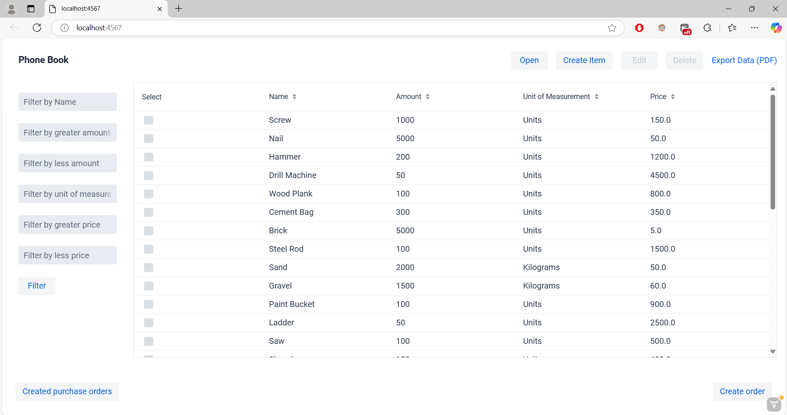
* Choose items:
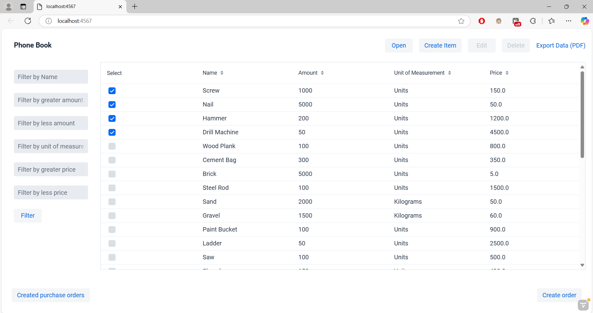
* Create order:
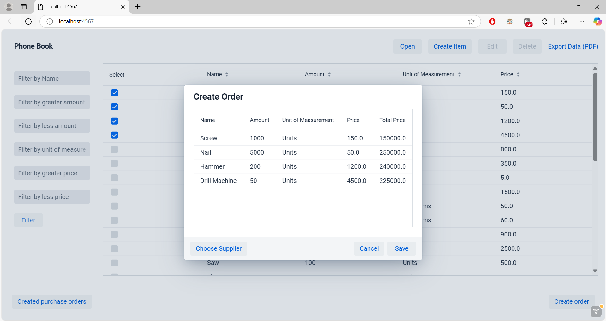
* Filter by name "p":
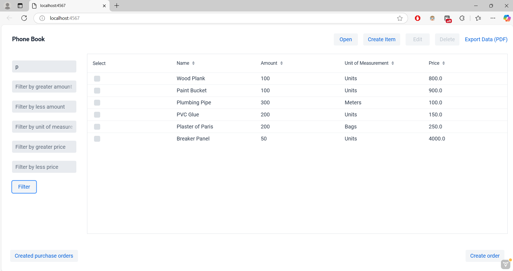
* Filter by name "p", Amount between 100 and 200, Price between 100 and 300:
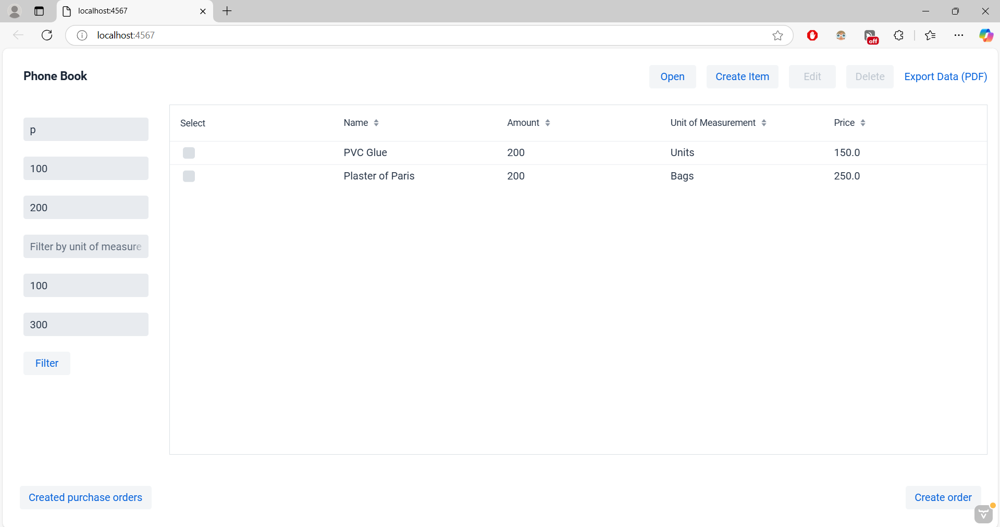

* Old phonebook version:

* MainView:

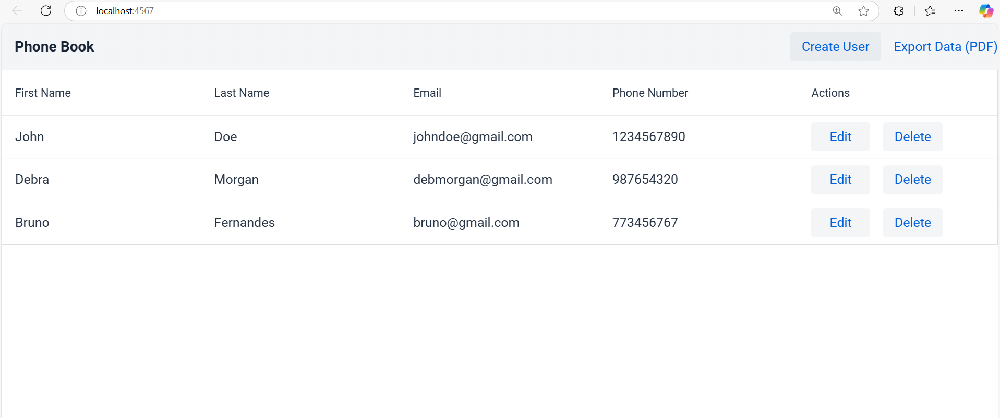

Creating a user:
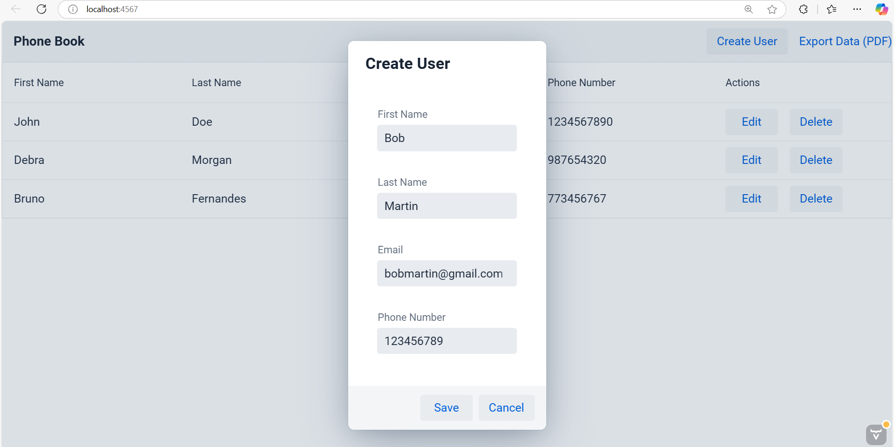
User created:
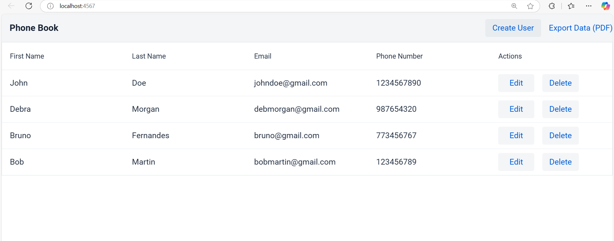
Editing user, we can use users old data:
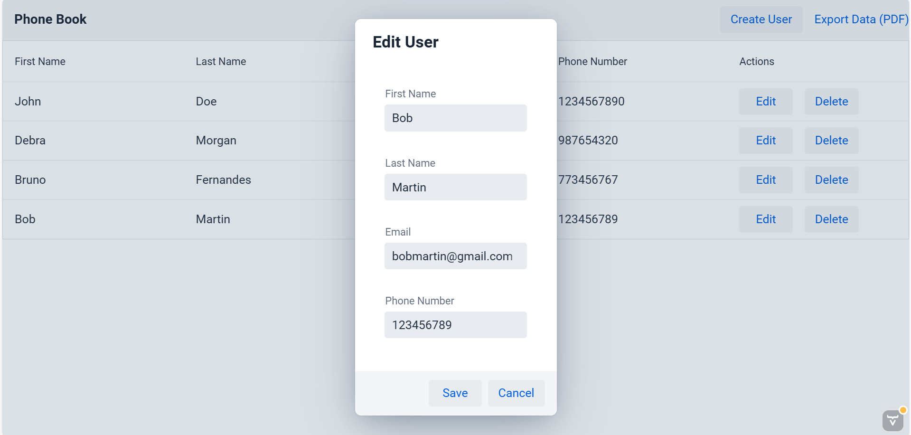
Editing user, new data, changed Phone Number:
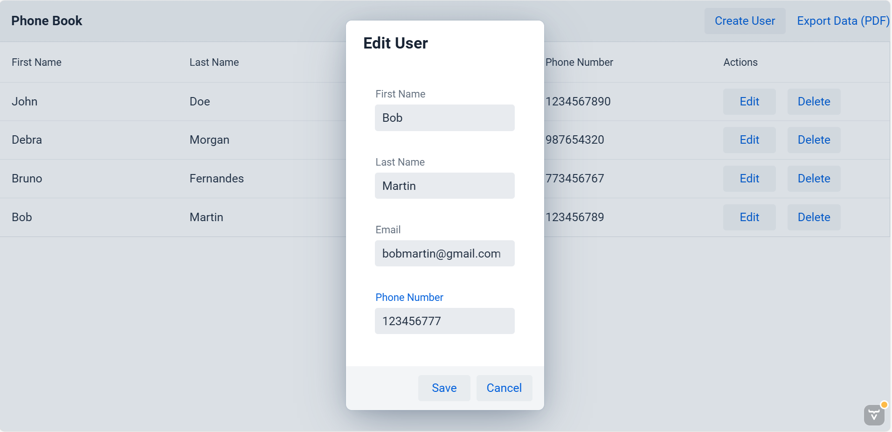
Editing user, saved data:
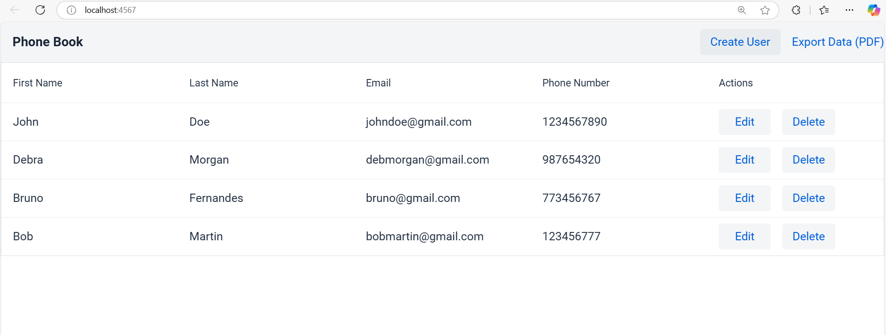

Downloaded pdf from Export Data (PDF):
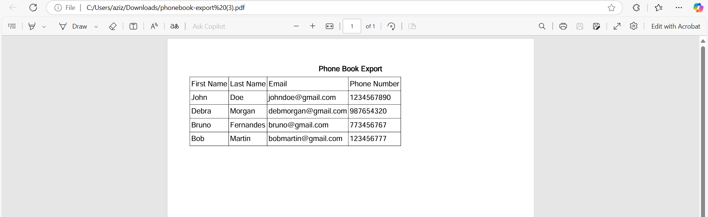

Delete button used:
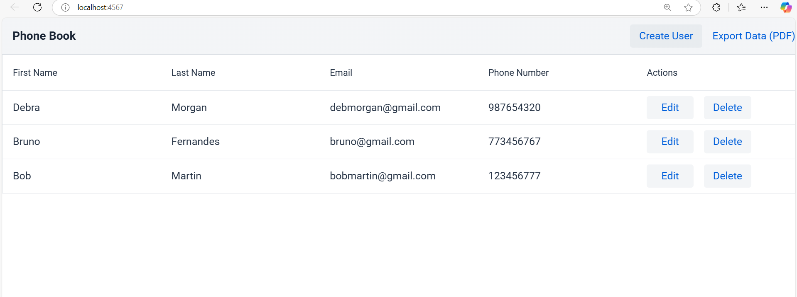